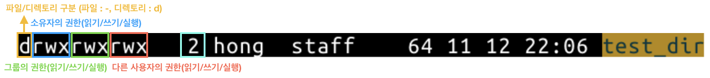

# chmod

파일/디렉토리의 접근 권한을 변경하는 명령어

* 파일의 소유자나 시스템 관리자만 `chmod`를 사용할 수 있음
* 설정할 파일 또는 디렉토리의 소유자, 파일 그룹, 다른 사용자에 대한 권한을 설정할 수 있음

-------------------------


## 사용법

> chmod [옵션] [모드] [파일명]

### 모드

리눅스의 파일과 디렉토리마다 각각의 권한이 있으며, 이를 **모드** 라고 부른다.  
아래의 명령어로 파일별 모드 조회 가능

``` bash
❯ ls -l
drwxrwxrwx   2 hong  staff    64 11 12 22:06 test_dir
``` 

명령어로 조회된 파일의 첫번쨰 10칸을 모드라고 부르며, 각 칸은 아래의 의미를 가진다.



소유자/그룹/다른사용자 순으로 권한이 표시되며, 권한은 기호(rwx) 또는 8진수(421)로 변경할 수 있다.

-------------------------

### 기호(rwx)로 권한 변경

* 소유자(User), 그룹(Group), 다른 사용자(Other)의 첫 글자를 약어로 사용
* 권한을 주려면 `+` 기호를 사용하며, 권한을 빼고 싶다면 `-` 기호를 사용
* 읽기(r), 쓰기(w), 실행(x)이며, 하나 또는 모든 권한을 한번에 적용할 수 있음


``` bash
❯ ls -l
----------  1 hong  staff    0 11 12 22:42 test.txt

# 소유자(u)에게 읽기(r), 쓰기(w) 권한 적용
❯ chmod u+rw test.txt
❯ ls -l
-rw-------  1 hong  staff  0 11 12 22:42 test.txt

# 소유자(u)의 읽기(r), 쓰기(w)을 권한을 제거하고, 소유자(u), 다른 사용자(o)에게 실행(x) 권한 추가
❯ chmod u-rw,uo+x test.txt
---x-----x  1 hong  staff    0 11 12 22:42 test.txt
```

#### 사용자 기호

| 대상 	| 약자 	| 설명 	|
|------------------	|:----:	|-----------------------------------------------------------------------	|
| 소유자 (User) 	| u 	| 파일/디렉토리의 소유자 	|
| 그룹 (Group) 	| g 	| 파일/디렉토리의 그룹 	|
| 다른 사용자 (Other 	| o 	| 다른 사용자 	|
| 전체 (All) 	| a 	| 소유자, 그룹, 다른 사용자 모두 (대상을 선택하지 않으면 기본으로 설정) 	|


#### 권한 기호

| 권한 	| 약자 	| 설명 	|
|----------------------------------------------	|:----:	|-------------------------------------------------------	|
| 읽기 (read) 	| r 	| 파일/디렉토리의 읽기 권한 	|
| 쓰기 (write) 	| w 	| 파일/디렉토리의 쓰기 권한 	|
| 실행 (execute) 	| x 	| 파일/디렉토리의 실행 권한 	|
| 유저/그룹 권한으로 설정 (set user(group) id) 	| s 	| 파일 실행시 파일의 소유자 또는 그룹 권한으로 실행 	|
| 소유자 (User) 	| u 	| 현재 파일/디렉토리의 소유자 권한과 동일하게 설정 	|
| 그룹 (Group) 	| g 	| 현재 파일/디렉토리의 그룹 권한과 동일하게 설정 	|
| 다른 사용자 (Other) 	| o 	| 현재 파일/디렉토리의 다른 사용자 권한과 동일하게 설정 	|

#### 설정 기호

| 설정 | 약자 | 설명 |
|------|:----:|------|
| 추가 | + | 입력한 권한을 추가 |
| 제거 | - | 입력한 권한을 제거 |
| 지정 | = | 사용자에게 지정된 권한만 추가하고 그 외 설정된 나머지 권한은 제거 |

--------------------

### 8진수로 권한 변경

* 4자리의 8진수를 이용해 파일/디렉토리의 권한을 변경  
* 사용자별로 정해진 자릿수가 있으며, 각 자릿수에 지정하고자 하는 권한을 더한다.
    * 소유자 - 백의 자리 (__X00__)
    * 그룹 - 십의 자리 (__X0__)
    * 다른 사용자 (__X__)
    * 소유자 권한 실행 - 천의 자리 (__X000__)
        * 4000/2000 : 파일 실행시 소유자 혹은 그룹 권한으로 실행
        * 1000 : sticky 비트
* 권한별 8진수는 `읽기(4)`, `쓰기(2)`, `실행(1)`

``` bash
❯ ls -l
----------  1 hong  staff    0 11 12 22:42 test.txt

# 소유자(X00)와 그룹(X0)에게 쓰기(2), 실행(1) 권한 추가
# 200(소유자의 쓰기 권한) + 100(소유자의 실행 권한) + 20(그룹의 쓰기 권한) + 10(그룹의 실행 권한) = 330
❯ chmod 330 test.txt
--wx-wx---  1 hong  staff    0 11 12 22:42 test.txt

# 모든 권한 제거
❯ chmod 000 test.txt
----------  1 hong  staff    0 11 12 22:42 test.txt
```
